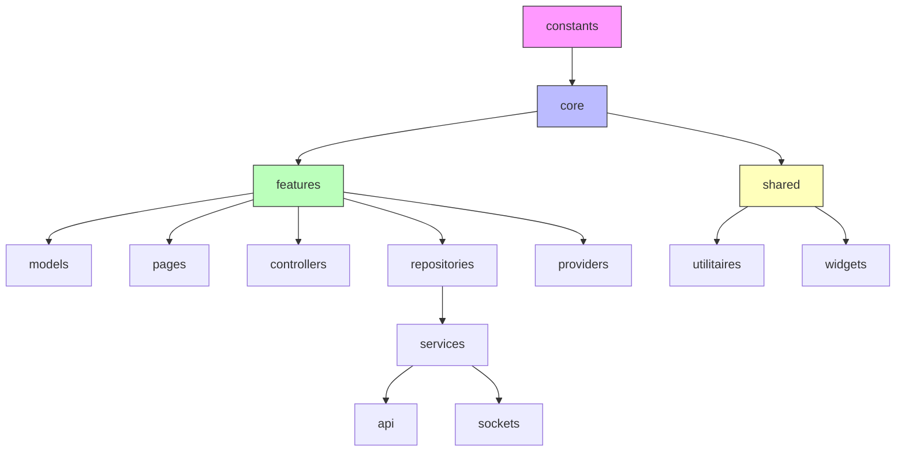

Voici un **document en Markdown** qui décrit les rôles de chaque dossier/fichier dans une architecture Flutter/Dart modulaire, puis un schéma centralisé pour visualiser la hiérarchie :

---

# 📂 Architecture des dossiers

## 🔧 `constants`
- Contient toutes les **valeurs fixes** (couleurs, tailles, clés, URLs, etc.).
- Sert de **point central** pour éviter la duplication et faciliter la maintenance.

---

## 🎮 `controllers`
- Gèrent la **logique métier** et les interactions entre la vue et les données.
- Souvent utilisés avec **State Management** (ex. Provider, Riverpod, GetX).
- Exemple : `UserController` qui orchestre la récupération et la mise à jour des données utilisateur.

---

## ⚙️ `core`
- Contient les **fondations techniques** du projet.
- Exemples :
  - Configurations globales (thème, routes, exceptions).
  - Librairies internes (animations, helpers).
  - Middlewares.

---

## ✨ `features`
- Chaque **fonctionnalité** est isolée dans son propre module.
- Structure recommandée :
  ```
  features/
    auth/
      models/
      pages/
      controllers/
      services/
    clubs/
      models/
      pages/
      repositories/
  ```
- Favorise la **scalabilité** et la séparation des responsabilités.

---

## 📑 `models`
- Définissent les **structures de données** (classes, DTO, entités).
- Exemple : `UserModel`, `ClubModel`.
- Peuvent inclure la sérialisation/désérialisation (`fromJson`, `toJson`).

---

## 📄 `pages`
- Contiennent les **écrans principaux** (UI).
- Exemple : `LoginPage`, `PageClubsSportifs`.
- Reliés aux widgets et aux contrôleurs.

---

## 🧩 `providers`
- Gèrent l’**état global** et exposent les données aux widgets.
- Exemple : `ChangeNotifierProvider` ou `Riverpod Provider`.

---

## 📦 `repositories`
- Abstraction entre les **sources de données** (API, DB locale, cache).
- Exemple : `UserRepository` qui combine API + SQLite.
- Permet de changer facilement la source sans impacter la logique métier.

---

## 🔌 `services`
- Contiennent les **services techniques** :
  - `api/` → appels HTTP, gestion des endpoints.
  - `sockets/` → gestion des WebSockets, temps réel.
- Exemple : `AuthApiService`, `ChatSocketService`.

---

## 🛠️ `shared`
- Code **mutualisé** entre plusieurs features.
- Exemple :
  - `utilitaires/` → helpers, extensions, fonctions communes.
  - `widgets/` → composants UI réutilisables (`CustomAppBar`, `RechercheBloc`).

---

# 🗂️ Schéma centralisé



---

## 🎯 Résumé
- **`constants`** : valeurs fixes globales.  
- **`core`** : fondations techniques.  
- **`features`** : modules fonctionnels isolés.  
- **`models`** : structures de données.  
- **`pages`** : écrans UI.  
- **`controllers`** : logique métier.  
- **`providers`** : gestion d’état.  
- **`repositories`** : abstraction des sources de données.  
- **`services`** : API & sockets.  
- **`shared`** : utilitaires et widgets réutilisables.  

---

👉 Veux-tu que je complète ce schéma avec un **flux de données** (ex. `UI → Controller → Provider → Repository → Service → API`) pour montrer comment les couches interagissent ?