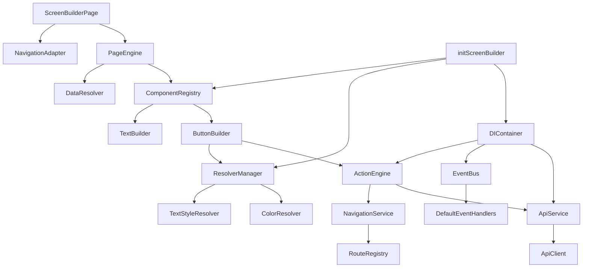

# Dependencies Graph - Screen Builder

## Explications
- ScreenBuilderPage dépend de PageEngine pour construire les pages.
- PageEngine utilise ComponentRegistry pour les builders et DataResolver pour les props.
- Builders comme ButtonBuilder dépendent d'ActionEngine pour actions et ResolverManager pour résolution.
- ActionEngine peut appeler ApiService ou NavigationService.
- initScreenBuilder configure tout via DIContainer.</content>
<parameter name="filePath">c:\Users\pc\Downloads\maroc_sport_copie-main\package\screen_builder\docs\dependencies-graph.md